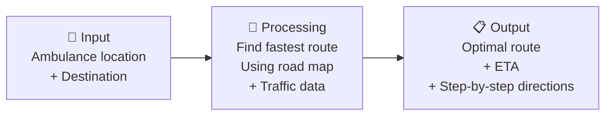
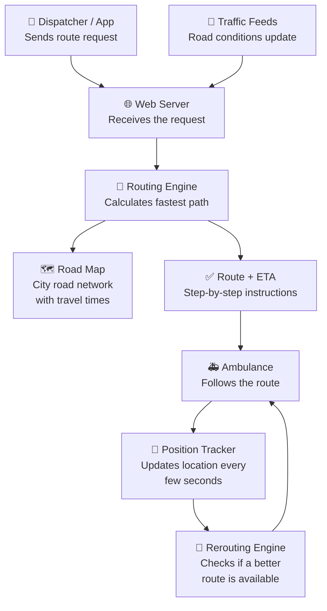
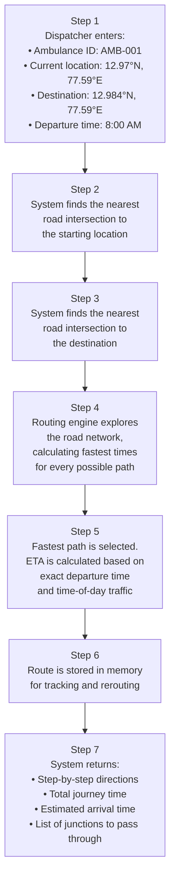
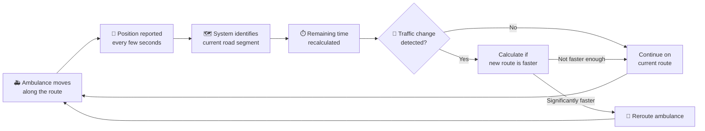
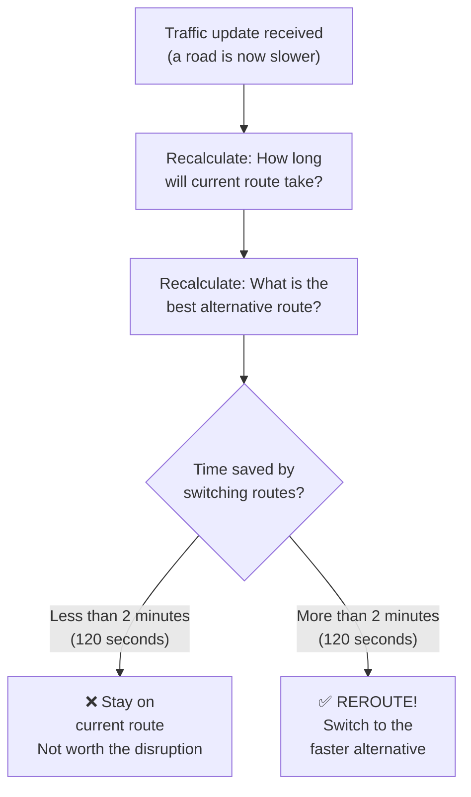
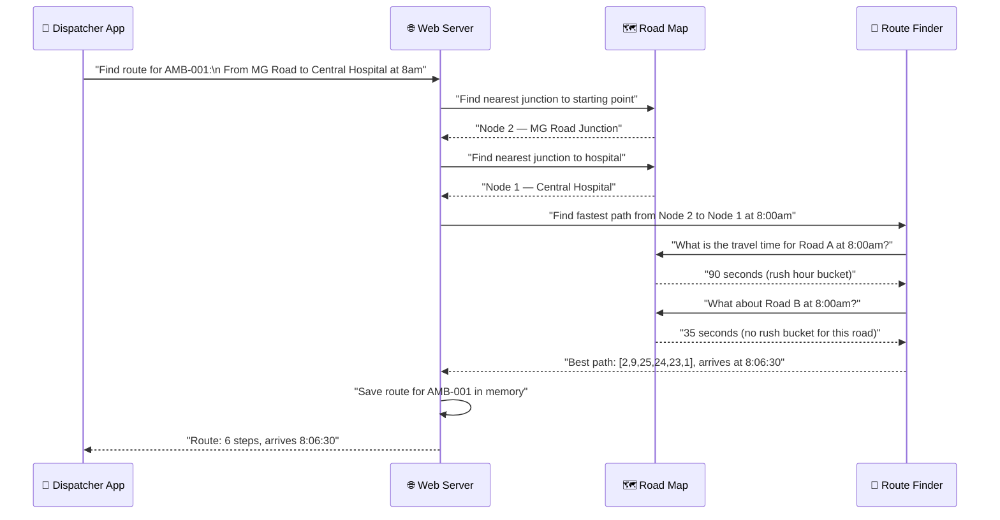
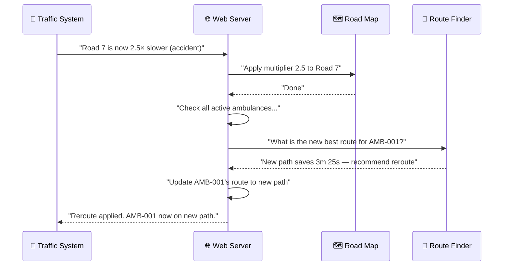

# Emergency Ambulance Routing System
## A Complete Beginner's Guide

> **Who is this for?** Non-technical readers, first-year engineering students, recruiters,
> project reviewers, managers, and anyone curious about how the system works.
> No computer science background required.

---

## Table of Contents

1. [Introduction — Every Second Counts](#1-introduction--every-second-counts)
2. [Why Is This Needed?](#2-why-is-this-needed)
3. [Project Overview — The Big Picture](#3-project-overview--the-big-picture)
4. [Imagine Yourself As The Ambulance](#4-imagine-yourself-as-the-ambulance)
5. [How Does The Project Think?](#5-how-does-the-project-think)
6. [Understanding The Road Network](#6-understanding-the-road-network)
7. [What Happens When A Route Is Requested?](#7-what-happens-when-a-route-is-requested)
8. [What Happens During The Journey?](#8-what-happens-during-the-journey)
9. [What Is Dynamic Traffic?](#9-what-is-dynamic-traffic)
10. [What Happens If Traffic Suddenly Increases?](#10-what-happens-if-traffic-suddenly-increases)
11. [What Is ETA?](#11-what-is-eta)
12. [What Happens Behind The Scenes?](#12-what-happens-behind-the-scenes)
13. [Main Features](#13-main-features)
14. [A Small Example — Walking Through A Real Journey](#14-a-small-example--walking-through-a-real-journey)
15. [Technologies Used](#15-technologies-used)
16. [What Makes This Project Interesting?](#16-what-makes-this-project-interesting)
17. [Future Improvements](#17-future-improvements)
18. [Conclusion](#18-conclusion)

---

## 1. Introduction — Every Second Counts

### The Story Begins With An Emergency

Imagine it is a Tuesday morning in Bangalore. A man named Suresh is at home when he
suddenly collapses. His family panics. Someone calls for an ambulance immediately.

The ambulance dispatcher receives the call. The nearest ambulance — **AMB-001** — is
dispatched from a station near MG Road. The destination is Central Hospital, just a few
kilometres away.

Sounds straightforward, right?

Now imagine this: it is 8:30 in the morning. Rush hour. Brigade Road is completely
jammed. MG Road is moving slowly. There is a minor accident blocking Residency Road.
Half the roads in the city are crawling.

The ambulance driver knows the city well, but the driver cannot see the entire road
network at once. The driver cannot calculate, in real time, which combination of roads
will get to the hospital the fastest. And traffic conditions are changing every minute.

**Every second that passes is critical.**

According to medical research, for cardiac emergencies, survival rates drop significantly
after every passing minute without treatment. For stroke patients, every minute of delay
can mean permanent brain damage. The phrase used by emergency responders is:

> *"Time is muscle. Time is brain."*

This is the problem that the **Emergency Ambulance Routing System** was built to solve.

---

### What This Project Does

The Emergency Ambulance Routing System is a software system that:

- Figures out the **fastest route** from an ambulance's current location to the hospital
- Understands that roads are **slower at some times of day** than others (rush hour, etc.)
- **Monitors traffic in real time** and updates the route if conditions change
- Automatically **reroutes the ambulance** if a faster road opens up or a road becomes blocked
- **Tracks the ambulance's position** as it moves
- **Calculates ETA** (Estimated Time of Arrival) and updates it as traffic changes
- Provides a **simulation tool** to test and verify everything without needing a real ambulance

It is not just a map. It is a live, intelligent routing brain.

---

## 2. Why Is This Needed?

### The Problem With "Use Your Eyes"

A city road network is not a simple straight line. A city is a maze of dozens, sometimes
hundreds, of intersecting roads, junctions, one-way streets, and shortcuts. Even
experienced drivers cannot instantly calculate the fastest route while also driving.

Here are the real problems that this system solves:

---

### Problem 1 — Traffic Congestion

```
         Morning Rush Hour (8:00 AM – 10:00 AM)
         ┌─────────────────────────────────────────┐
         │  Brigade Road:   normally  35 seconds   │
         │  Today at 8am:   actually  90 seconds   │
         │  Difference:               55 seconds   │
         └─────────────────────────────────────────┘
```

At 8am on MG Road in Bangalore, a stretch that normally takes 40 seconds can take up to
110 seconds during morning rush hour. The system knows this. It plans around it.

---

### Problem 2 — Road Closures and Accidents

A road that was open five minutes ago might now be blocked because of an accident. A
driver who planned to take that route has no way to know unless they hear it on the radio
or see it themselves — usually too late.

This system receives **live updates** about road conditions and immediately recalculates
whether the ambulance should switch to a different road.

---

### Problem 3 — The Changing Nature of Traffic

Traffic is not static. It is alive. It changes minute by minute.

| Time of Day | Road Condition |
|-------------|---------------|
| 7:00 AM — 10:00 AM | Heavy traffic. Roads take 2× to 3× longer. |
| 10:00 AM — 4:00 PM | Moderate traffic. Roads are relatively clear. |
| 4:00 PM — 8:00 PM | Evening rush. Traffic builds up again. |
| 8:00 PM onwards | Light traffic. Roads are mostly clear. |

A good routing system needs to understand **when** you are travelling, not just **where**
you are going.

---

### Problem 4 — Human Limitations

No dispatcher can simultaneously:
- Monitor 10 ambulances
- Track live traffic on every road in the city
- Recalculate optimal routes every 30 seconds for each ambulance
- Log every route decision for review later

This system does all of that, automatically, every time traffic changes.

---

### The Consequence of Getting It Wrong

| Delay | Potential Medical Impact |
|-------|--------------------------|
| 1 minute | Survivability of cardiac arrest begins to drop |
| 4 minutes | Brain damage from stroke can become permanent |
| 8 minutes | Cardiac arrest survival probability drops below 50% |

Faster routing saves lives. This is not an exaggeration.

---

## 3. Project Overview — The Big Picture

### What Goes In, What Comes Out

The system can be understood as three simple steps:



---

### The Complete System At A Glance



---

### The Three Brains of the System

The project has three core modules that work together:

| Module | What It Does | Real-World Analogy |
|--------|-------------|-------------------|
| **Road Map** (`core/graph.py`) | Stores all roads, junctions, and distances | The physical map of the city |
| **Route Finder** (`core/routing.py`) | Calculates the fastest path through the map | A navigator comparing all possible roads |
| **Simulator** (`core/simulator.py`) | Tests a complete ambulance journey without a real ambulance | A flight simulator for ambulances |

---

## 4. Imagine Yourself As The Ambulance

*Let us tell the story from the ambulance's point of view.*

---

**08:00:00 — The Call Comes In**

I am Ambulance AMB-001, parked near MG Road Junction in Bangalore. My radio crackles.
A man named Suresh at Frazer Town has had a cardiac emergency. I need to get to Central
Hospital as fast as possible.

My dispatcher enters two things into the system:
- Where I am right now (MG Road Junction)
- Where I need to go (Central Hospital)

---

**08:00:01 — The System Thinks**

The routing system wakes up. It looks at the entire road network of Bangalore — 50
intersections, 118 road segments. It knows that right now, at 8am, Brigade Road is
running at nearly triple its normal travel time because of morning rush hour.

It compares every possible combination of roads I could take. It picks the combination
that will get me there the fastest, given the current traffic at this exact moment.

In less than a millisecond, it has an answer.

---

**08:00:01 — I Receive My Route**

The system tells me:

> *"Take MG Road Junction → Shivaji Nagar → Mayo Hall → KR Market → Kalasipalyam →*
> *Central Hospital. Estimated arrival: 08:06:30. Total time: 6 minutes 30 seconds."*

I start moving.

---

**08:02:15 — Traffic Changes**

I am passing through Shivaji Nagar. Suddenly, there is a traffic update from the city's
monitoring system: there has been a vehicle breakdown on Mayo Hall road. That stretch,
which was going to take me 35 seconds, will now take 180 seconds — five times longer.

The routing system receives this update automatically.

---

**08:02:15 — Should I Reroute?**

The system calculates:
- If I stick to my current route, I will arrive in **8 minutes 45 seconds** from now.
- If I switch to Corporation Circle → KR Market, I will arrive in **5 minutes 20 seconds**.
- That is **3 minutes 25 seconds** saved — well above the threshold the system uses
  to trigger a reroute (which is 2 minutes).

The system says: **Reroute.**

---

**08:02:16 — New Route Received**

I receive updated instructions. I take a right turn and head toward Corporation Circle
instead.

---

**08:06:42 — Arrival**

I arrive at Central Hospital. The system logs my arrival. Suresh is now in the hands of
the emergency doctors.

The entire routing process — from request to arrival, including a mid-journey reroute —
happened automatically and in real time.

---

## 5. How Does The Project Think?

### A City Full of Choices

Imagine you are standing at a junction in Bangalore. You need to reach the hospital.
In front of you, there are three roads you could take. Each road leads to another
junction, which has more roads. And so on.

The number of possible routes through a city is enormous. A city with 50 intersections
could have thousands of different possible paths between any two points.

The question is: **How do you find the fastest one without checking every single
combination?**

---

### The Smart Way to Search

Think of it like this: you are in a building and you want to find the exit. You could
randomly wander through every corridor — that would take forever. OR, you could follow
a simple rule:

> *"Always go in the direction that seems most promising. Mark the corridors you have
> already checked so you do not repeat them. Keep track of how long each path took."*

This is exactly what the routing engine does, but with roads instead of corridors.

The key insight is this: **you do not need to explore dead ends**. If you have already
found a route to the hospital that takes 6 minutes, there is no need to keep exploring
any road that has already taken you more than 6 minutes to reach it.

The system keeps a mental scoreboard:

```
Scoreboard (how quickly I can reach each junction):
  MG Road Junction:   0 seconds   (I am here)
  Shivaji Nagar:     35 seconds   (via MG Road)
  Mayo Hall:         70 seconds   (via Shivaji Nagar)
  KR Market:        100 seconds   (via Mayo Hall)
  Central Hospital: 130 seconds   (via KR Market)
```

At every junction, it asks: *"Is there a faster way to reach this junction than what I
currently know?"* If yes, it updates the scoreboard. If no, it moves on.

The result is the fastest possible route, found very quickly.

---

### The Clock-Aware Version

There is one more twist. Roads are not equally fast at all times of day.

The system does not just ask: *"How fast is this road?"*

It asks: *"How fast is this road **right now**, at the exact time I will be passing
through it?"*

If the ambulance leaves at 8:00 AM and takes 5 minutes to reach a junction, it will
arrive at that junction at 8:05 AM — still during rush hour. The next road's travel
time is calculated based on 8:05 AM traffic, not 8:00 AM traffic.

This is called **time-dependent routing**, and it is what makes this system accurate in
the real world.

---

## 6. Understanding The Road Network

### Cities Are Made of Two Things

A city's road network can be broken down into just two simple concepts:

```
┌─────────────────────────────────────────────────────────────────┐
│  INTERSECTIONS (called "Nodes")                                 │
│  These are the junctions, crossroads, and landmarks.           │
│  Example: MG Road Junction, Central Hospital, Trinity Circle   │
│                                                                  │
│  ROADS (called "Edges")                                         │
│  These connect one intersection to another.                     │
│  Each road has: distance, base travel time, and traffic info.  │
└─────────────────────────────────────────────────────────────────┘
```

---

### How a Road Is Described

Every road in the system carries specific information:

| Information | What It Means | Example |
|-------------|---------------|---------|
| **From** | Which intersection the road starts at | MG Road Junction |
| **To** | Which intersection the road ends at | Central Hospital |
| **Base Time** | How long this road takes under normal conditions | 40 seconds |
| **Distance** | Physical length of the road | 800 metres |
| **Rush Hour Times** | How long it takes during busy periods | 90 seconds (7am–10am) |
| **Multiplier** | A scaling factor that can be applied in real time | 2.0 means double the time |

---

### The City Map Used in This Project

The system ships with a real map of **central Bangalore**, with 50 named locations
and 118 road connections between them. Some of the landmarks in the map include:

```
Central Hospital     •——————•  MG Road Junction
         |                         |
         •  Brigade Road           •  Trinity Circle
         |                         |
         •  Halasuru          •————•  Ulsoor Lake
              |               |
              •  Domlur        •  Indira Nagar
```

Real locations from the map include:
- Central Hospital, St. John's Hospital, Jayanagar Hospital
- MG Road Junction, Brigade Road, Residency Road
- Shivaji Nagar, Frazer Town, Cantonment
- Koramangala, Lalbagh Gate, KR Market, Mayo Hall

This allows the routing to be tested on a real-world-inspired road network.

---

### Rush Hour in the Map

The city map includes built-in rush hour knowledge. For example:

```
MG Road Junction → Central Hospital:
  Normal time:         40 seconds
  Morning rush (7–10am):  90 seconds   (2.25× slower)
  Evening rush (4–8pm):   110 seconds  (2.75× slower)
```

The system automatically uses the correct travel time based on what time the ambulance
will actually pass through each road segment.

---

## 7. What Happens When A Route Is Requested?

### Step by Step — From Request to Route



---

### What the System Returns

After calculating a route, the system gives back something like this:

```
Ambulance: AMB-001
Algorithm: Dijkstra
Total Time: 6 minutes 30 seconds
Estimated Arrival: 08:06:30 UTC

Route Steps:
  Node 9  (12.9800, 77.5900) → Node 25 (12.9770, 77.5880)  in 0m 35s
  Node 25 (12.9770, 77.5880) → Node 24 (12.9750, 77.5860)  in 0m 30s
  Node 24 (12.9750, 77.5860) → Node 23 (12.9700, 77.5860)  in 0m 40s
  Node 23 (12.9700, 77.5860) → Node 1  (12.9700, 77.5900)  in 0m 30s
```

---

### Two Ways to Calculate Routes

The system offers two calculation methods. Both give the same answer, but they work
slightly differently:

| Method | How It Works | Best For |
|--------|-------------|----------|
| **Dijkstra** | Explores all roads equally, step by step, keeping a scoreboard of the fastest known time to each junction | Reliable, always correct |
| **A\*** | Same as Dijkstra, but uses a shortcut: it also guesses how far each junction is from the hospital using straight-line distance, and prioritises junctions that seem to be in the right direction | Faster on large maps |

Think of it this way:
- **Dijkstra** is like looking behind every door in the building equally
- **A\*** is like looking behind doors that face the direction of the exit first

Both will find the exit. A\* just tends to find it faster because it avoids exploring
obviously wrong directions.

On the 50-node Bangalore map, both methods find routes in under one millisecond — faster
than the blink of an eye.

---

## 8. What Happens During The Journey?

### The Ambulance is Moving — But the System is Still Watching

Once the ambulance starts moving, the work is not done. The system continues monitoring.



---

### Position Updates

The ambulance driver's system (or the dispatcher's app) can send position updates to the
routing server. These updates tell the system:

- The ambulance's current GPS coordinates
- The time of the position report

The system then:
1. Figures out which road segment the ambulance is currently on
2. Calculates how much time is left to reach the hospital
3. Checks whether any recent traffic changes have made a new route worthwhile

---

### Journey Status Tracking

The system tracks every ambulance with one of four statuses:

| Status | What It Means |
|--------|--------------|
| **EN_ROUTE** | Moving toward the destination on the current route |
| **REROUTED** | Switched to a new route due to traffic changes |
| **ARRIVED** | Has reached the destination |
| **ASSIGNED** | Route calculated, journey about to begin |

---

## 9. What Is Dynamic Traffic?

### Traffic Is Not a Fixed Number

When most people think about traffic, they imagine a simple idea: "there's traffic on
this road." But real traffic is far more complex.

Traffic is **dynamic** — it changes constantly based on many factors.

---

### Things That Cause Traffic Changes

| Event | Effect on Roads |
|-------|----------------|
| **Morning rush hour** (7–10 AM) | Major roads take 2–3× longer |
| **Evening rush hour** (4–8 PM) | Major roads take 2–3× longer |
| **Road accident** | One road becomes blocked or very slow |
| **Road construction** | A road is partially closed for weeks |
| **Cricket match or concert** | Roads near the venue become gridlocked |
| **Festival (Dasara, Diwali)** | Many roads across the city slow down |
| **Heavy rain** | Flooded roads become impassable |
| **Roadblock or VIP convoy** | Entire roads may be temporarily closed |

---

### How This System Models Traffic

The system uses two powerful tools to handle dynamic traffic:

**Tool 1: Time Buckets (Scheduled Traffic Patterns)**

A road can have pre-programmed knowledge about when it will be busy. For example:

```
Road: Brigade Road → Central Hospital
  Base time:    35 seconds (normal)
  7am – 10am:  120 seconds (morning rush, 3.4× slower)
```

This knowledge is baked into the map before the journey starts.

**Tool 2: Live Traffic Multipliers (Real-Time Updates)**

At any moment, the system can receive a live update that says:

> *"Edge 7 (Trinity Circle → Ulsoor Lake) now has a multiplier of 2.5 — it's
> 2.5 times slower than normal because of an accident."*

The system instantly applies this to all ongoing route calculations.

**Tool 3: Absolute Time Override**

For extreme situations (road completely blocked), the system can set a road's travel
time to a specific value, bypassing all other calculations:

> *"Edge 3 (MG Road → Brigade Road) now takes exactly 9,999 seconds" — effectively
> treating it as closed.*

---

### Priority Order

When the system is calculating how long a road will take, it follows this priority:

```
┌─────────────────────────────────────────────────────────────┐
│  1. Absolute override set? → Use that number               │
│  ↓ (if not)                                                 │
│  2. Rush hour time bucket matches current time? → Use that  │
│  ↓ (if not)                                                 │
│  3. Use base time × current multiplier                      │
└─────────────────────────────────────────────────────────────┘
```

---

## 10. What Happens If Traffic Suddenly Increases?

### The Rerouting Moment

This is one of the most important features of the system. Let us walk through it with a
concrete example.

---

### The Scenario

An ambulance is heading from Frazer Town to Central Hospital. At 8:02 AM, there was a
truck breakdown on a key road.

```
Before the incident:
  Remaining journey on current route:  8 minutes 30 seconds
  Best alternative route:              8 minutes 40 seconds
  Difference:                          only 10 seconds — NOT worth rerouting

After the truck breakdown:
  Remaining journey on current route:  14 minutes 20 seconds (road is jammed)
  Best alternative route:              8 minutes 50 seconds
  Difference:                          5 minutes 30 seconds — REROUTE!
```

---

### How the System Decides

The system compares two numbers every time there is a traffic update:



The 2-minute threshold is important. Without it, the ambulance might constantly switch
routes for tiny improvements, causing confusion and wasted time. The threshold ensures
rerouting only happens when it genuinely matters.

---

### The Slowdown Detection Feature

There is a second way rerouting can be triggered, even before the time-saving threshold
is reached.

The system looks ahead at the **next 3 road segments** on the current route. If any of
those roads is now taking **1.5 times longer** than it was when the route was originally
calculated, the system flags it as a potential problem and recalculates.

```
Example:
  Segment 2 of current route (Mayo Hall → Corporation Circle):
    Originally planned:    35 seconds
    Current actual time:   75 seconds (2.14× slower)
    Threshold ratio:       1.5
    75 / 35 = 2.14 > 1.5  →  SLOWDOWN DETECTED → recalculate
```

This is like a scout riding ahead to check if the road is clear before the ambulance
reaches it.

---

### What Happens After a Reroute

When a reroute is triggered:
1. The new path replaces the old path in the system
2. The ETA is updated to reflect the new arrival time
3. The status changes to **REROUTED**
4. A log entry is created: which ambulance, what time, old route, new route, time saved
5. The dispatcher's screen shows the updated route

The ambulance driver receives the new directions immediately.

---

### The Reroute History Log

Every time a reroute happens, the system permanently records it:

```json
{
  "ambulance_id": "AMB-001",
  "timestamp": "2026-06-12T08:02:16Z",
  "old_path": [9, 25, 24, 23, 1],
  "new_path": [9, 31, 26, 25, 24, 23, 1],
  "time_saved_sec": 210.0,
  "new_eta": "2026-06-12T08:06:42Z"
}
```

This log can be reviewed after the fact to understand every routing decision that was made.

---

## 11. What Is ETA?

### The Magic Number

**ETA** stands for **Estimated Time of Arrival**. It is the system's best prediction of
when the ambulance will reach the hospital.

ETA is not a fixed number — it is a living calculation that changes as circumstances
change.

---

### How ETA Is Calculated

```
ETA  =  Departure Time  +  Total Journey Time

Total Journey Time  =  Time on Road 1  +  Time on Road 2  +  Time on Road 3  + ...
```

But here is the clever part: **each road's time is evaluated at the moment you will
actually be passing through it**, not at the moment you depart.

**Example:**
- Ambulance departs at **8:00 AM**
- Reaches Shivaji Nagar junction at **8:00:35** (after 35 seconds)
- At **8:00:35**, the next road (Shivaji Nagar → Mayo Hall) still has rush-hour
  traffic, so it will take **90 seconds** instead of the normal **45 seconds**
- Arrives at Mayo Hall at **8:02:05**
- And so on...

This "time-aware" calculation is what makes the ETA accurate in real traffic.

---

### When ETA Changes

| Event | Effect on ETA |
|-------|--------------|
| Traffic suddenly gets worse on a road ahead | ETA increases |
| A new bypass road opens or clears up | ETA decreases |
| Ambulance takes a reroute | ETA is fully recalculated |
| Ambulance sends a position update | Remaining time is recalculated from current position |
| Rush hour ends while ambulance is still travelling | ETA decreases because upcoming roads become faster |

---

### How Accurate Is It?

On a 200-node map, route calculations complete in under **0.2 milliseconds**. This means
the system can recalculate the ETA dozens of times per second if needed — always giving
the most current, accurate prediction possible.

---

## 12. What Happens Behind The Scenes?

### The Technical Journey of a Route Request

Even though this guide avoids deep technical details, it is useful to understand how
the various parts of the system work together.



---

### What Happens When Traffic Changes



---

### What the System Keeps in Memory

While an ambulance is active, the system tracks:

```
AMB-001:
  Current position:    12.9715°N, 77.5920°E  (MG Road Junction)
  Current segment:     Segment 2 of 5
  Planned path:        Nodes [2, 9, 25, 24, 23, 1]
  ETA:                 08:06:30 UTC
  Remaining time:      4 minutes 29 seconds
  Status:              EN_ROUTE
  Last updated:        08:02:01 UTC
```

This information is updated every time:
- The ambulance sends a position report
- A traffic update changes any road on the route
- A reroute is triggered

---

## 13. Main Features

### Everything This System Can Do

Here is a complete list of all features, explained in plain language:

---

**Feature 1 — Fast Route Calculation**

The system can calculate the fastest route through a city in under one millisecond.
It handles rush-hour traffic automatically based on the time of departure.

---

**Feature 2 — Two Routing Algorithms**

Choose between two calculation methods: Dijkstra (thorough, always correct) and A\*
(smarter search, faster on large maps). Both give the same answer; A\* just gets there
more efficiently on large road networks.

---

**Feature 3 — Time-Dependent Travel Times**

Roads can have different travel times at different times of day. An 8am journey uses
8am traffic data. A 2pm journey uses 2pm traffic data. A journey that starts at 7:55am
and takes 15 minutes uses the correct traffic data for each road segment as it is
traversed.

---

**Feature 4 — Live Traffic Updates**

At any moment, the system can receive information that a road is slower (or faster) than
usual. This is applied immediately to all ongoing route calculations.

---

**Feature 5 — Automatic Rerouting**

When traffic changes, the system automatically checks whether any active ambulance
should switch to a different route. If rerouting would save at least 2 minutes, the
reroute is applied automatically without any human action needed.

---

**Feature 6 — Slowdown Detection**

The system looks ahead at the next 3 road segments. If any of them is now 1.5× slower
than planned, it triggers a reroute check — even before a full 2-minute saving is
confirmed.

---

**Feature 7 — Ambulance Position Tracking**

The ambulance can report its GPS position. The system tracks which road segment the
ambulance is on, updates the remaining journey time, and detects if the ambulance has
arrived at the hospital.

---

**Feature 8 — ETA Calculation and Updates**

An Estimated Time of Arrival is calculated at the start of the journey and updated
whenever traffic changes or the ambulance reports a new position.

---

**Feature 9 — Journey Simulation**

The system includes a complete simulator that can replay an entire ambulance journey
in "fast forward" — without waiting in real time. The simulator can inject traffic
events at specific points in the journey and check whether the rerouting logic handles
them correctly.

Simulation events include:

| Event | Meaning |
|-------|---------|
| **DEPART** | Ambulance leaves the starting point |
| **SEGMENT** | Ambulance completes one road segment |
| **TRAFFIC** | A traffic update is applied mid-journey |
| **REROUTE** | Ambulance switches to a new route |
| **ARRIVE** | Ambulance reaches the destination |

---

**Feature 10 — Route History and Logging**

Every reroute event is logged with full details: old path, new path, time saved, and
timestamp. This creates an auditable trail of every routing decision.

---

**Feature 11 — Debug and Inspection Tools**

The system includes developer tools to:
- See the current state of every road in the map (including any active traffic overrides)
- List all active ambulances and their current status
- View the complete history of all reroute events
- Reset all traffic overrides back to normal

---

**Feature 12 — Input Validation**

Every request is carefully checked before processing:
- Coordinates must be valid latitude/longitude values
- Ambulance IDs have maximum length limits
- Traffic multipliers must be between 0.01 and 1,000
- Edge update batches are limited to 500 updates per request

If invalid data is sent, the system returns a clear error message instead of crashing.

---

**Feature 13 — Docker Support**

The entire system can be started with a single command using Docker — a technology that
packages the application with all its requirements so it runs identically on any computer.

---

**Feature 14 — Automated Testing (87 Tests)**

The system has 87 automated tests that verify every part of the logic. These tests are
run automatically whenever code is changed, catching any mistakes before they reach
production.

---

**Feature 15 — Continuous Integration (CI/CD)**

Every time code is pushed to the project's repository, a robot automatically:
- Checks that the code follows consistent formatting rules
- Checks that imports are organised correctly
- Checks that the code does not have style problems
- Runs all 87 tests and confirms they pass
- Does this on two different Python versions simultaneously

---

## 14. A Small Example — Walking Through A Real Journey

### A Tiny City with Four Intersections

The system ships with a small 4-node example map that is perfect for understanding
how routing works. Let us walk through it completely.

---

### The Map

```
          Node 1  ─────────── Node 2
        (Start)    40 seconds   (Junction A)
           │                      │
           │ 120 seconds          │ 40 seconds
           │                      │
          Node 3 ◄────────── Node 4
        (Hospital)   60 seconds  (Junction B)
                        ▲
                        │ 60 seconds
                        │
                    Node 2 also connects to Node 4
```

Let us use real numbers:

| Road | From | To | Normal Time | Distance |
|------|------|----|-------------|----------|
| Edge 1 | Node 1 | Node 2 | 40 seconds | 800m |
| Edge 2 | Node 2 | Node 3 | 40 seconds | 950m |
| Edge 3 | Node 1 | Node 3 | 120 seconds | 2,200m |
| Edge 4 | Node 2 | Node 4 | 60 seconds | 700m |
| Edge 5 | Node 4 | Node 3 | 60 seconds | 700m |
| Edge 6 | Node 3 | Node 4 | 40 seconds | 800m |

---

### Question 1: What Is the Fastest Route from Node 1 to Node 3?

The possible routes are:

```
Route A: Node 1 → Node 2 → Node 3
  Time: 40 + 40 = 80 seconds

Route B: Node 1 → Node 3 (direct)
  Time: 120 seconds

Route C: Node 1 → Node 2 → Node 4 → Node 3
  Time: 40 + 60 + 60 = 160 seconds
```

**Winner: Route A — 80 seconds.** The system picks this.

---

### Question 2: What If Traffic Suddenly Makes Edge 2 Slow?

Imagine an accident on Edge 2 (Node 2 → Node 3). The traffic system sends an update:

> *"Edge 2 now has a multiplier of 3.0 — it takes 3× longer than normal."*

New travel times:

```
Route A: Node 1 → Node 2 → Node 3
  Time: 40 + (40 × 3.0) = 40 + 120 = 160 seconds  ← now much slower!

Route B: Node 1 → Node 3 (direct)
  Time: 120 seconds

Route C: Node 1 → Node 2 → Node 4 → Node 3
  Time: 40 + 60 + 60 = 160 seconds
```

Now **Route B (direct) is the fastest at 120 seconds.**

---

### Question 3: Does the System Reroute the Ambulance?

Let us say the ambulance was already on Route A and had just passed Node 2 when the
accident happened.

```
Before accident:  Old remaining time on Route A = 40 seconds (just Edge 2 left)
After accident:   New remaining time on Route A = 120 seconds (Edge 2 is 3× slower)

But now, best new route from Node 2 = stay on Route A = 120 seconds
(No other option exists from Node 2, since the only edge from Node 2 to destination
is through Node 2→Node 3 directly or Node 2→Node 4→Node 3)
```

In this small 4-node example, after passing Node 2, the best route is to continue
through Node 2 → Node 4 → Node 3 = 60 + 60 = 120 seconds.

Original remaining time: 120 seconds. New via bypass: 120 seconds. Savings: 0.
**No reroute triggered** — both options are equal.

If traffic made Edge 2 take 300 seconds (7.5× slower), then:
```
Old remaining (via jammed Edge 2):    300 seconds
New remaining (via Node 4 bypass):     120 seconds
Time saved:                            180 seconds

180 seconds > 120 second threshold  → REROUTE!
```

**The ambulance switches to the bypass route.** The system saved 3 minutes.

---

### The Timeline of This Journey

```
08:00:00  AMB-001 departs Node 1 → destination Node 3
          Route: [1, 2, 3]   ETA: 08:01:20

08:00:40  AMB-001 arrives at Node 2
          TRAFFIC UPDATE: Edge 2 now takes 300s (7.5× slower)

08:00:40  System recalculates:
          Old remaining via Edge 2:     300 seconds
          New remaining via Node 4:     120 seconds
          Saved:                        180 seconds  →  REROUTE!

08:00:40  NEW ROUTE: [2, 4, 3]   New ETA: 08:02:40

08:01:40  AMB-001 arrives at Node 4

08:02:40  AMB-001 arrives at Node 3  ← ARRIVED
          Total journey:  160 seconds  (2 min 40 sec)
```

Without rerouting, the journey would have taken **340 seconds** (5 min 40 sec).
The reroute **saved exactly 3 minutes**.

---

## 15. Technologies Used

### The Building Blocks of This System

The system is built using several technologies, each chosen for a specific purpose.
Here is what they are and why they were used:

---

### Python

**What it is:** Python is a programming language — a way to write instructions for a
computer. It is widely regarded as one of the most readable and beginner-friendly
programming languages in the world.

**Why it was used:** Python is excellent for writing routing algorithms and web servers.
It has a rich set of tools for scientific and engineering work. The entire project — all
routing logic, the web server, the simulator, and the tests — is written in Python.

---

### FastAPI

**What it is:** FastAPI is a tool for building web APIs — the communication layer that
allows external applications (like a dispatcher's app) to talk to the routing system
over the internet.

**Why it was used:** FastAPI is very fast and modern. It automatically generates
interactive documentation that lets developers explore and test the API from a web
browser. It also validates all incoming data automatically, rejecting invalid requests
before they cause problems.

---

### Pydantic

**What it is:** Pydantic is a data validation library. It defines what "correct" input
data looks like, and automatically rejects anything that does not match.

**Why it was used:** Without validation, someone could send nonsense data to the system
(like a latitude of 9,999 degrees) and potentially cause a crash or incorrect routing.
Pydantic catches these problems at the door.

---

### Docker

**What it is:** Docker is a tool that packages an application and all its requirements
into a single, self-contained "container." Think of it like shipping a fully-furnished
apartment instead of just the blueprints — everything needed to run the application is
included.

**Why it was used:** With Docker, the system can be started on any computer with a
single command: `docker-compose up`. No manual installation. No configuration. It
runs identically whether you are on a laptop in Bangalore or a server in London.

---

### Pytest

**What it is:** Pytest is a testing framework — a tool for writing and running
automated tests.

**Why it was used:** Software bugs are inevitable. Automated tests catch them before
they reach production. The project has 87 tests that verify everything from basic
route calculation to complex rerouting scenarios. These tests run in seconds and can
be run any time code changes are made.

---

### GitHub Actions (CI/CD)

**What it is:** GitHub Actions is a robot that automatically runs tasks whenever code
is changed and uploaded to the project.

**Why it was used:** Every time a developer makes a change, GitHub Actions
automatically runs all 87 tests and checks the code for style issues — on two different
Python versions simultaneously (Python 3.10 and 3.11). If anything breaks, the
developer is told immediately, before the broken code affects anyone else.

---

### The Algorithms (Briefly)

**Dijkstra's Algorithm** — invented by Dutch computer scientist Edsger W. Dijkstra in
1956 — is a method for finding the shortest path between two points in a network. It
is used in GPS navigation systems, internet routers, and games. This project uses a
time-aware version of it that accounts for rush-hour traffic.

**A\* (A-Star)** — an enhancement of Dijkstra's algorithm that uses an educated guess
about which direction to search. It uses the straight-line "as the crow flies" distance
to the destination as a hint, allowing it to skip exploring obvious dead ends. On large
maps, this can make it significantly faster than plain Dijkstra.

---

## 16. What Makes This Project Interesting?

### Beyond a Simple Map App

This project is not just a navigation app with a nice interface. It is a backend
infrastructure system — the intelligent brain that a real-world ambulance dispatch
system would run on. Here is what makes it stand out:

---

**It Solves a Real Problem**

The project addresses one of the most time-critical challenges in emergency medicine:
getting help to patients faster. The algorithms and features are all directly motivated
by real-world constraints — rush-hour patterns, sudden accidents, road closures.

---

**It Thinks in Time, Not Just Distance**

Most GPS systems optimise for the shortest distance or a static travel time estimate.
This system optimises for the **actual travel time at the exact moment you will be
on each road segment**. A 2km road during rush hour might be slower than a 3km bypass
at the same time. The system knows this.

---

**It Reacts, Not Just Plans**

A static navigation system tells you the best route at the moment you start. This
system continuously monitors and updates. If the road ahead of you becomes jammed,
the system detects it and reroutes you — automatically, without any human having to
notice and make the call.

---

**It Is Production-Ready**

The system is not a proof-of-concept. It has:
- Input validation on every API endpoint
- Structured logging in both human-readable and machine-readable formats
- Docker packaging for deployment
- Automated CI/CD pipeline
- 87 tests covering all code paths
- Configuration through environment variables so settings can be changed without
  modifying code

These are the marks of professional, production-grade software.

---

**It Is Fast Enough for the Real World**

The routing engine calculates routes in under 0.2 milliseconds on a 200-node graph.
Even at 1,000 simultaneous requests, the computation would take under 200 milliseconds
total. The real bottleneck in production would be network latency, not computation.

---

**It Is Extensible**

Adding a new routing algorithm is a matter of implementing one function and registering
it in the API. Adding a new map source requires implementing one loader function.
The architecture is designed to grow without requiring major rewrites.

---

## 17. Future Improvements

### What Could Come Next

The current system is a complete, working MVP (Minimum Viable Product). There are many
exciting directions it could grow in:

---

**Real Map Data from OpenStreetMap**

Right now, the road network is defined in JSON files created by hand. The next step
would be to import real road data from **OpenStreetMap** — the open-source map of the
world. This would allow the system to work with any city in the world, with tens of
thousands of intersections and real road data.

---

**Live GPS and Traffic Integration**

Currently, traffic updates are sent manually via the API. In a real deployment, the
system would receive:
- **Live traffic feeds** from city monitoring cameras or crowd-sourced apps
- **Real-time GPS location** from the ambulance's on-board device, updating automatically

---

**WebSocket Live Streaming**

Right now, position updates are sent one at a time via individual requests. WebSockets
would allow the ambulance to maintain a persistent connection and stream its position
continuously, and receive route updates as soon as they happen — like a live phone call
instead of exchanging text messages.

---

**Multiple Ambulances with Dispatch Optimisation**

When there are multiple emergencies at the same time, which ambulance should go where?
This is a complex optimisation problem. A future version could find the best assignment
of multiple ambulances to multiple emergencies simultaneously, minimising total response
time across all incidents.

---

**Hospital Recommendation**

Not all hospitals can treat all emergencies. A future version could consider:
- Hospital capacity (is the emergency department full?)
- Specialisation (is this the right hospital for a cardiac patient vs. a trauma case?)
- Travel time to multiple nearby hospitals

And recommend the best hospital, not just the nearest one.

---

**Traffic Prediction Using Historical Data**

With enough historical data, the system could predict future traffic, not just react to
current traffic. An ambulance departing at 7:55 AM could be told:

> *"By the time you reach Brigade Road, it will be 8:02 AM and rush hour will be at its
> peak. I am routing you to avoid Brigade Road entirely."*

---

**ETA Confidence Intervals**

Instead of saying "you will arrive at 8:06:30", a future version could say:

> *"You will most likely arrive at 8:06:30, but due to traffic uncertainty, it could be
> anywhere between 8:05:45 and 8:08:00 (90% confidence)."*

This would give dispatchers a more realistic picture of response time.

---

**Artificial Intelligence for Pattern Learning**

Machine learning models could learn from historical journeys to:
- Identify unusual traffic patterns before they cause problems
- Improve travel time predictions beyond what scheduled time-buckets can provide
- Detect and flag data anomalies (e.g., a traffic sensor reporting false data)

---

**Database Persistence**

Currently, all active routes are stored in the server's memory. If the server restarts,
all route data is lost. A production system would store routes in a database
(like PostgreSQL), so data survives server restarts and can be analysed later.

---

## 18. Conclusion

### What Has Been Built

The Emergency Ambulance Routing System is a complete, working backend for intelligent
ambulance dispatching. It understands that roads are slower at rush hour, reacts
instantly to traffic changes, and automatically keeps ambulances on the fastest possible
route throughout their journey.

In a city like Bangalore with its complex road network and extreme traffic variability,
a system like this could make a measurable difference in emergency response times —
and ultimately, in lives saved.

---

### What It Currently Achieves

| Capability | Status |
|------------|--------|
| Calculate fastest route through city map | ✅ Working |
| Use time-of-day traffic data | ✅ Working |
| Accept live traffic updates | ✅ Working |
| Automatic rerouting when traffic changes | ✅ Working |
| Ambulance position tracking | ✅ Working |
| ETA calculation and updates | ✅ Working |
| Complete journey simulation | ✅ Working |
| Two routing algorithms (Dijkstra + A\*) | ✅ Working |
| Input validation and error handling | ✅ Working |
| 87 automated tests | ✅ Passing |
| Docker deployment | ✅ Ready |
| CI/CD pipeline | ✅ Active |

---

### The Foundation Is Laid

Every great system starts with a solid foundation. This project has:

- **Correct algorithms** that produce accurate routes
- **Real-world thinking** about how traffic actually behaves
- **Production-quality engineering** with testing, validation, and deployment support
- **A clear path forward** toward real GPS data, real maps, and real-time integration

What exists today is a backend system that is ready to be connected to a real
dispatcher interface, a real ambulance GPS tracker, and a real city traffic feed.
Those connections are engineering tasks. The hard part — the intelligent routing brain
that makes good decisions under changing conditions — is already built.

---

### A Final Thought

The next time you see an ambulance racing through traffic with its sirens on, remember
what is happening:

Someone is counting every second.

Somewhere, a system like this one is doing hundreds of calculations per second,
comparing routes, evaluating traffic, and making split-second decisions — all so that
help arrives as fast as physically possible.

**That is the purpose of the Emergency Ambulance Routing System.**

---

*Document written based on direct inspection of the complete source code of the
Emergency Ambulance Routing System, version 1.0.0.*

*Project repository: github.com/chikatlarakesh/ambulance-routing*
