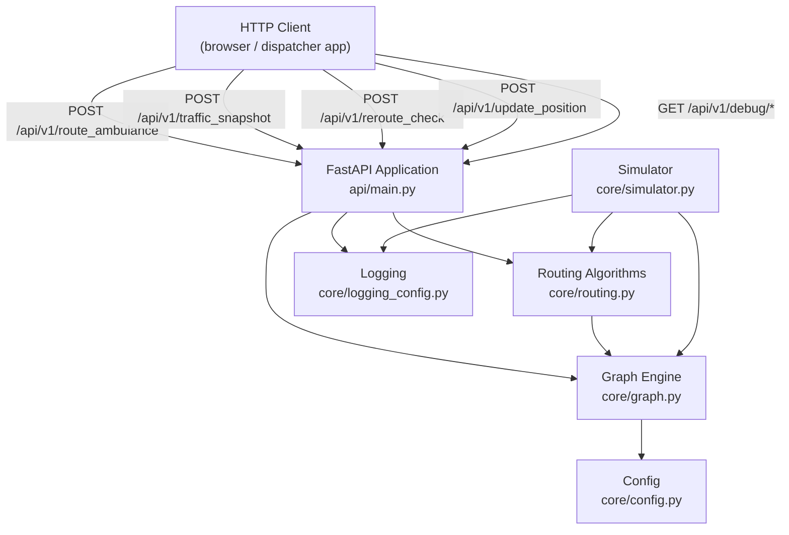
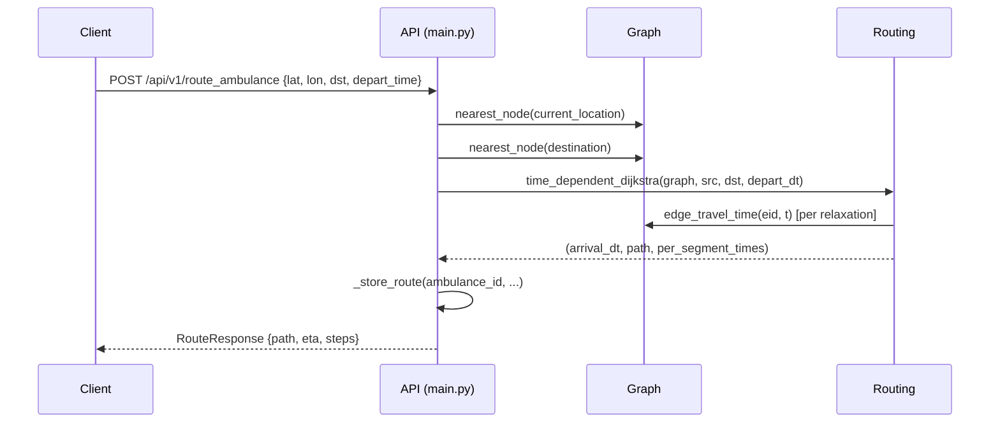
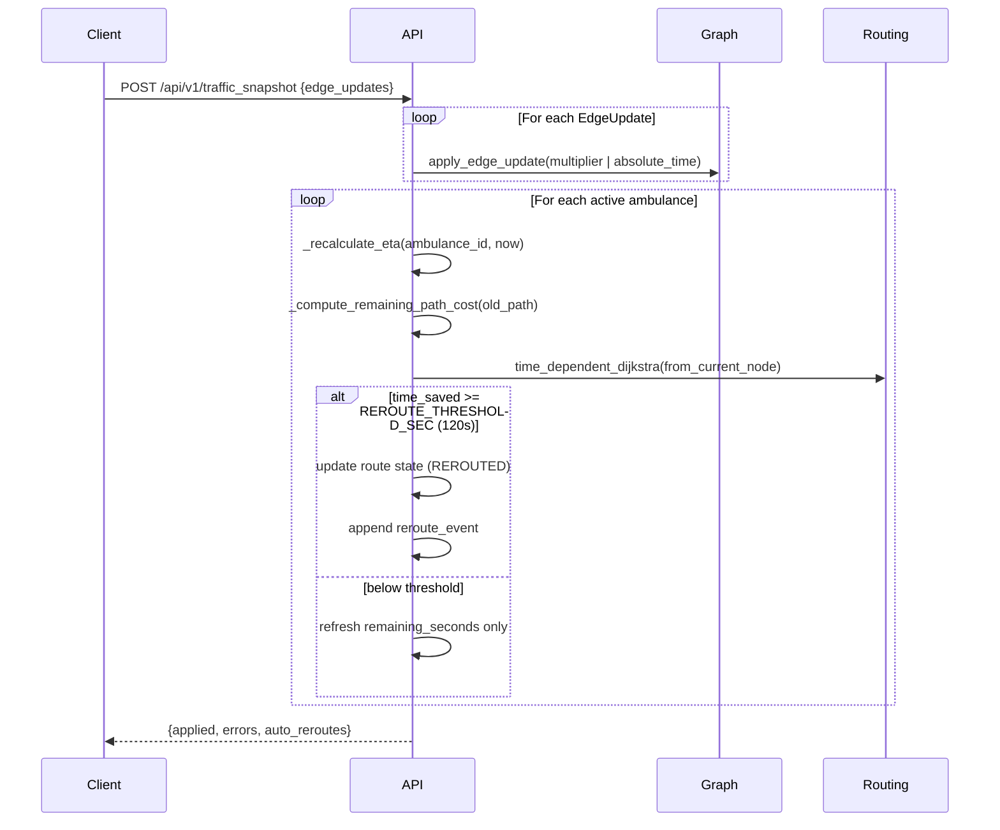
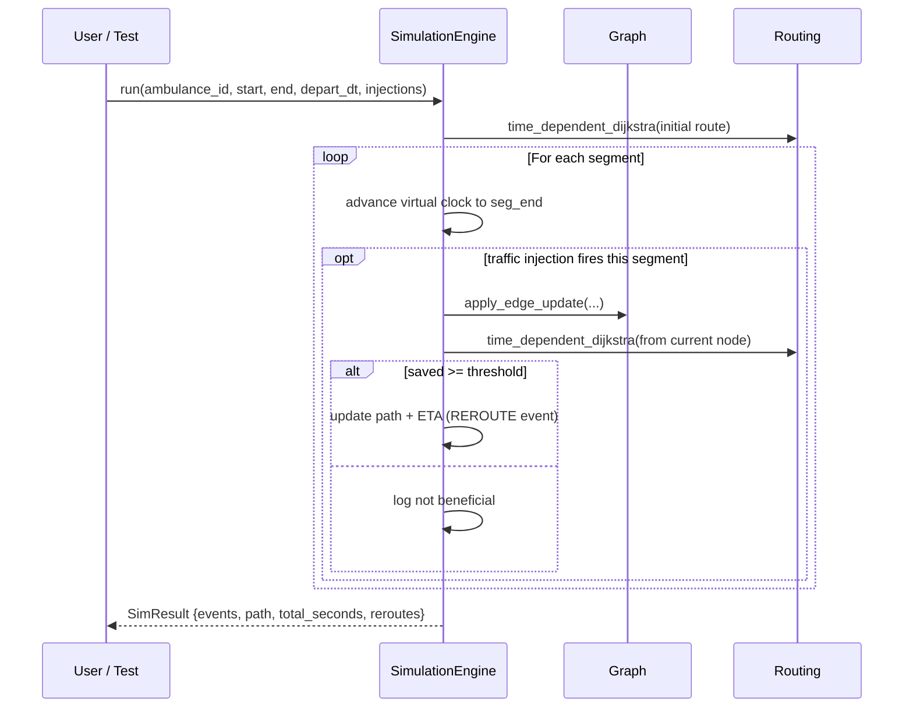
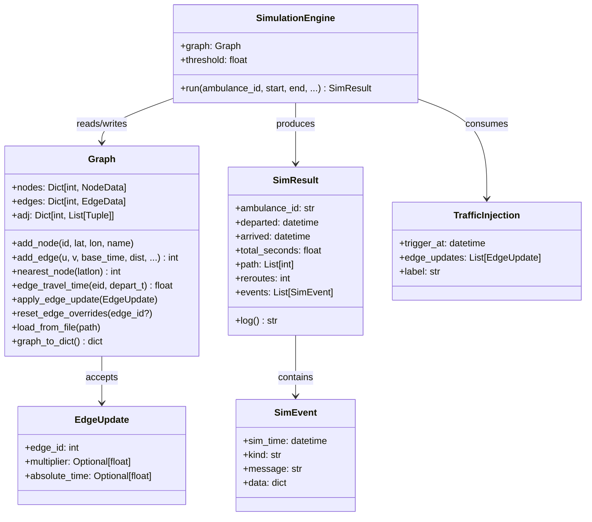
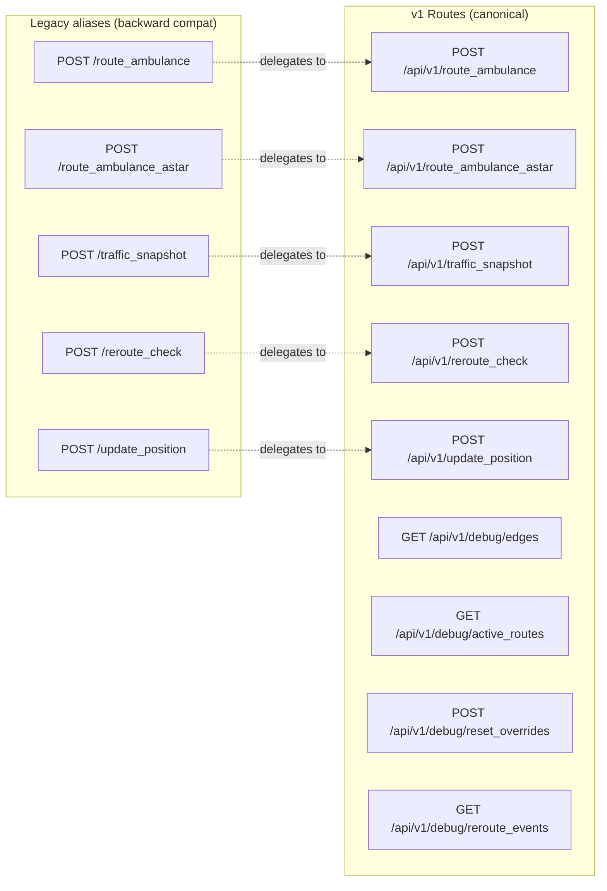

# Architecture Reference

## 1 — System Overview



---

## 2 — Folder Structure

```
ambulance-routing/
|
+-- api/
|   +-- main.py             # FastAPI app, middleware, endpoints, route logic
|   +-- schemas.py          # All Pydantic request/response models + validators
|   +-- __init__.py
|
+-- core/
|   +-- graph.py            # Graph, nodes, edges, travel-time, traffic updates
|   +-- routing.py          # Dijkstra, A*, time-dependent helpers
|   +-- simulator.py        # Virtual-time simulation engine
|   +-- config.py           # All tunable constants (env-var overridable)
|   +-- logging_config.py   # Structured logging setup
|   +-- __init__.py
|
+-- benchmarks/
|   +-- benchmark.py        # Algorithm micro-benchmark (Dijkstra vs A*)
|   +-- load_test.py        # HTTP stress test (100/500/1000 concurrent)
|
+-- tests/
|   +-- test_api.py         # FastAPI endpoint tests (87 tests)
|   +-- test_graph.py       # Graph unit tests
|   +-- test_routing.py     # Routing algorithm tests
|   +-- test_simulator.py   # Simulator unit tests
|
+-- examples/
|   +-- sample_graph.json   # 4-node Bangalore sample
|   +-- city_graph.json     # 50-node Bangalore city graph
|   +-- traffic_snapshot.json
|
+-- docs/
|   +-- architecture.md     # This file
|   +-- benchmark_report.md # Auto-generated by benchmarks/benchmark.py
|   +-- DEMO.md
|
+-- Dockerfile              # Multi-stage production build
+-- docker-compose.yml      # Single-command startup
+-- pyproject.toml          # Black, isort, mypy, pytest config
+-- .flake8                 # Flake8 lint config
+-- .github/workflows/      # CI: lint + test on Python 3.10 & 3.11
```

---

## 3 — Route Request Flow



---

## 4 — Traffic Update + Auto-Reroute Flow



---

## 5 — Simulation Flow



---

## 6 — Class Relationships



---

## 7 — API Route Map



---

## 8 — Edge Travel Time Priority

```
absolute_time override (set via /traffic_snapshot)
        |
        v  (if not set)
matching time_bucket (seconds-of-day in range) * multiplier
        |
        v  (if no bucket matches)
base_time * multiplier
```

---

## 9 — Reroute Decision Logic

```
old_remaining = _compute_remaining_path_cost(current_graph, old_path, from_node, now)
new_remaining = Dijkstra(from_node, dest, now).arrival - now

time_saved = old_remaining - new_remaining

if time_saved >= REROUTE_THRESHOLD_SEC (default 120s):
    REROUTE

elif any of next SLOWDOWN_LOOKAHEAD (3) edges has current_travel_time / baseline > SLOWDOWN_RATIO (1.5):
    REROUTE
```

The key insight: `old_remaining` is computed from the **current graph costs** (not the stale stored ETA),
so reroute decisions are always based on actual current conditions.
